# Weather ETL Pipeline – Daily Automated Data Ingestion & Orchestration




A complete, production-ready **end-to-end ETL pipeline** built during my career transition from Data Science to Data Engineering.

- **Extracts** current weather data for Bournemouth, UK from OpenWeatherMap API  
- **Transforms** it (temperature conversion, rounding, quality flag)  
- **Loads** it into a Supabase PostgreSQL database  
- **Orchestrates & schedules** daily runs with **Prefect 3**  
- **Containerizes** the flow runner and persistent worker using **Docker**

This project was my first serious step into Data Engineering — built from zero prior DE experience with a lot of debugging persistence.

**Status**: Fully functional locally (Dockerized, scheduled, observable)

## Project Motivation & Goals

Coming from a Data Science background (analysis, modeling, pandas), I wanted a fast, tangible project to learn core Data Engineering skills:

- Reliable data movement & infrastructure  
- ETL processes (ingestion → transformation → loading)  
- Workflow orchestration & scheduling  
- Database integration (relational, real-world)  
- Containerization & local deployment  
- Debugging production-like issues (connections, networking, env files)

**Why weather data?**  
- Public, free API with generous limits  
- Structured, time-series data — easy to verify  
- Real-world analogy: daily external data feed (e.g. logistics, marketing, agriculture)

**Outcome**: A scheduled, retryable, observable pipeline that runs automatically and loads clean data into a database every day.

## Features

- Daily automated execution (configurable schedule, e.g. 8 AM UTC)
- Retries, logging, and error handling built into Prefect tasks
- Secure secret management via `.env`
- Full observability via Prefect UI (flow graph, run history, logs)
- Dockerized for reproducibility and easy deployment
- Simple but realistic: API → Pandas → PostgreSQL

## Prerequisites

- Python 3.12+
- Docker Desktop (or Docker Engine on Linux)
- Free OpenWeatherMap API key → https://home.openweathermap.org/api_keys
- Free Supabase project → https://supabase.com (create table `weather_data` as shown below)
- Prefect 3 (installed via pip)

### Supabase Table Creation (run once in SQL Editor)

```sql
CREATE TABLE weather_data (
    id SERIAL PRIMARY KEY,
    date TIMESTAMP WITH TIME ZONE NOT NULL,
    city VARCHAR(100) NOT NULL,
    temp_kelvin NUMERIC(6,2),
    temp_celsius NUMERIC(6,2),
    humidity INTEGER,
    description VARCHAR(255),
    data_quality VARCHAR(50)
);

```

## Architecture & Tech Stack

### High-Level Flow

1. **Extract** → OpenWeatherMap API (current weather endpoint)  
2. **Transform** → Pandas (cleaning, unit conversion, derived columns)  
3. **Load** → Supabase PostgreSQL (transaction pooler)  
4. **Orchestrate** → Prefect 3 (flows, tasks with retries, logging)  
5. **Schedule** → Cron (e.g. daily at 8 AM UTC)  
6. **Containerize** → Docker (flow runner + persistent worker)  
7. **Observe** → Prefect UI (graph, logs, run history)

### Tech Stack

| Layer                  | Technology                     | Purpose / Why Chosen                                      |
|------------------------|--------------------------------|-----------------------------------------------------------|
| Language               | Python 3.12                    | Familiar from DS, excellent DE ecosystem                  |
| API Client             | requests                       | Simple, reliable, battle-tested                           |
| Data Processing        | pandas                         | Fast, familiar for transformation                         |
| Database Client        | psycopg2-binary                | Direct PostgreSQL access, no ORM overhead                 |
| Secrets                | python-dotenv                  | Standard, easy local secret management                    |
| Orchestration          | Prefect 3                      | Python-native, simpler than Airflow, great local UI       |
| Containerization       | Docker                         | Industry standard for reproducibility & deployment        |
| Database               | Supabase (PostgreSQL)          | Free hosted Postgres with easy UI                         |
| Data Source            | OpenWeatherMap API             | Free tier, real structured weather data                   |

## Step-by-Step Build Journey (Including Real Challenges)

### Phase 1: Environment & Database Setup
- Installed core libraries in venv  
- Obtained OpenWeatherMap API key  
- Created Supabase project & table

**Biggest Challenge**: Repeated "Tenant or user not found" / "Connection refused" errors  
**Root Causes**: Wrong pooler mode (direct vs transaction), IPv6 issues, incorrect username/port  
**Resolution**: Switched to transaction pooler (port 6543), copied exact string from dashboard, tested with debug script  
**Lesson**: Always verify connection independently before building pipeline

### Phase 2: Core ETL Logic
- Wrote extract (API + DF), transform (cleaning), load (INSERT) functions

**Challenge**: `datetime.utcnow()` deprecation warning  
**Fix**: Switched to timezone-aware `datetime.now(timezone.utc).isoformat()`  
**Lesson**: Pay attention to Python version-specific warnings

### Phase 3: Prefect Orchestration & Scheduling
- Decorated functions with `@task` and `@flow`  
- Added retries and logging  
- Deployed via interactive `prefect deploy`

**Challenges**:  
- Old `prefect deploy -f` syntax no longer worked  
- Backlog of late/scheduled runs when worker offline  
**Fixes**: Used new interactive CLI, wrote bulk cancellation script, paused schedules when needed  
**Lesson**: Orchestration tools evolve — read latest docs

### Phase 4: Containerization (Docker)
- Created `Dockerfile` for flow & `worker.Dockerfile` for persistent worker  
- Built & tested images

**Challenges**:  
- "No such file or directory" → wrong working directory  
- Invalid `requirements.txt` → accidentally copied bash heredoc into file  
- "Connection refused" to Prefect server inside container  
**Fixes**: Changed to correct folder, cleaned requirements, used `host.docker.internal` on macOS  
**Lesson**: Docker networking differs by OS — test connectivity inside container

### Phase 5: Final Testing & Polish
- Verified daily runs load data to Supabase  
- Added screenshots, `.env.example`, `.gitignore`  
- Documented full setup & troubleshooting

## How to Run Locally

### Prerequisites
- Python 3.12+
- Docker Desktop
- OpenWeatherMap API key
- Supabase project with `weather_data` table

### Steps

1. Clone repo
```
   git clone https://github.com/YOUR-USERNAME/weather-etl-pipeline.git
   cd weather-etl-pipeline
```


## Data Engineering Portfolio: Weather ETL Pipeline Project

Introduction
As part of my career transition from Data Science to Data Engineering, I built this end-to-end ETL pipeline project to gain hands-on experience with core DE concepts. The project was inspired by my need to quickly learn ETL processes, orchestration, database integration, scheduling, and containerization, while showcasing a deployable portfolio piece for DE job applications.
This design system document provides a comprehensive overview of the architecture, components, function flow, data flow, and design decisions for the Weather ETL Pipeline project.
The design emphasizes reliability, modularity, observability, and ease of deployment, drawing from the challenges faced during development (e.g., database connections, Docker networking, orchestration backlogs). All design choices were refined through iterative troubleshooting, ensuring the system is production-ready for local execution with potential for cloud scaling.

**Project Goal**: Build a simple ETL pipeline that fetches daily weather data from OpenWeatherMap API, transforms it, loads it into Supabase (PostgreSQL), orchestrates with Prefect 3, and deploys in Docker.

**My Role**: Solo developer, implementing code, debugging errors, and iterating.

**Outcome**: A working, automated pipeline running locally in containers, ready for cloud extension. This project helped me understand DE vs. DS (focus on reliability, scalability, automation).

### 1. System Architecture

#### High-Level Overview
The system is a batch ETL pipeline that runs on a configurable schedule (e.g., daily). It ingests raw weather data from an external API, processes it for quality and usability, stores it in a relational database, and is orchestrated in a containerized environment.

- Input: OpenWeatherMap API (JSON response)
- Processing: Python-based ETL logic with Prefect orchestration
- Output: Structured records in Supabase PostgreSQL table
- Deployment: Local Docker containers for flow execution and worker

#### Key Components

- Data Source: OpenWeatherMap API – Provides real-time weather data (temp, humidity, description) via HTTP GET. Chosen for free tier and structured output.
- ETL Layer: Python scripts with tasks for extract, transform, load. Uses pandas for transformation efficiency.
- Database: Supabase (hosted PostgreSQL) – Relational storage for time-series data. Table schema supports querying by date/city.
- Orchestration: Prefect 3 – Handles task dependencies, retries (e.g., 3 on load), logging, and scheduling. Local server provides UI for monitoring.
- Containerization: Docker – Two images: one for single flow runs, one for persistent worker. Ensures consistency across environments.
- Secrets Management: .env file – Stores API keys and DB credentials securely.


### 2. Function Flow & Data Flow
#### Function Flow Diagram (Mermaid)

- Extract: Fetches JSON, handles HTTP errors, returns Pandas DF. Flow: API call → JSON parse → DF creation.
- Transform: Input DF → cleaning (dropna, round) → derived columns (temp_celsius, data_quality) → output DF.
- Load: Input DF → DB connection → row-by-row INSERT (with ON CONFLICT) → commit/rollback on error.
- Error Flow: Tasks retry on failure (e.g., network/API error). Full flow logs to Prefect UI.

#### Data Flow

- Raw: JSON {temp (Kelvin), humidity, description}
- Transformed: DF with temp_celsius, rounded values, quality flag ("Good" if humidity 20–100%)
- Loaded: SQL rows with TIMESTAMP, VARCHAR, FLOAT, INTEGER columns
- Volume: ~1 row per run (daily) – scalable to multiple cities


_*Function Flow Diagram (Mermaid)*_


### 3. Design Decisions & Rationale

#### Modularity
- Tasks are separate functions for easy testing/reuse (e.g., extract can be run independently).
- Rationale: From troubleshooting, modular code helped isolate issues (e.g., DB only).

#### Reliability
- Retries on tasks (2 on extract for API flakiness, 3 on load for DB transients)
- Error handling: try/except + logging in each task
- Rationale: API/DB connections failed often during dev — this ensures production stability.

#### Scalability
- Prefect supports dynamic mapping for multi-city (future extension)
- Docker images allow easy scaling to cloud (e.g., Kubernetes)
- Rationale: Started simple but designed for growth, based on chat advice.

#### Security
- .env for secrets, ignored in Git
- No hard-coded credentials
- Rationale: Learned from env loading errors — secure from day 1.

#### Observability
- Prefect UI for flow graphs, run states, logs
- Custom logger in tasks
- Rationale: Essential for debugging backlogs/late runs.

### 4. Challenges & Resolutions in Design

- DB Connectivity: Initial design assumed simple connect — redesigned for pooler modes after errors.
- Scheduling: Daily cron, but backlogs from worker downtime → added pause/cancel mechanisms.
- Docker Networking: Host mode failed on macOS — redesigned with host.docker.internal.
- Deprecations: Updated datetime handling in transform function.
- File Management: Refined requirements.txt after build failures.

These influenced the design to prioritize robustness.

### 5. Future Enhancements
- Multi-city: Prefect mapping over city list
- Cloud: Deploy worker to Railway
- Alerts: Prefect notifications on failure
- Validation: Add post-load checks

## Step-by-Step Guide: How I Built the Project

This is the exact path I followed to move from idea to a working, scheduled pipeline.

#### Step 1: Set Up the Local Environment

1. Cloned the project and created a virtual environment.
2. Installed dependencies from `requirements.txt`.
3. Created a `.env` file with API and database credentials.

```bash
python -m venv .venv
source .venv/bin/activate
pip install -r requirements.txt
```

`.env` keys used by the code:

```env
OPENWEATHER_API_KEY=your_api_key_here
DATABASE_URL=your_supabase_transaction_pooler_url
```

#### Step 2: Create and Verify the Database

1. Created `weather_data` table in Supabase SQL Editor (schema shown earlier in this README).
2. Confirmed connectivity with `test_db.py`.

```bash
python test_db.py
```

If successful, the script prints a confirmation message.  
Main issue I hit here was connection failures from an incorrect pooler mode/credentials; switching to the transaction pooler URL fixed it.

#### Step 3: Build the Extract Task

I built `extract_weather_task()` in `etl_weather.py` to fetch Bournemouth weather from OpenWeatherMap and return a one-row DataFrame.

```python
@task(retries=2, retry_delay_seconds=30)
def extract_weather_task():
    params = {"q": CITY, "appid": API_KEY, "units": "metric"}
    response = requests.get(base_url, params=params, timeout=10)
    response.raise_for_status()
    # Parse JSON and return DataFrame
```

Key decision: use retries + timeout so temporary API/network issues do not kill the pipeline on first failure.

#### Step 4: Build the Transform Task

I added `transform_weather_task()` to clean and enrich data:
- Normalized city text
- Computed data quality flag from humidity range
- Returned a transformed DataFrame ready for loading

```python
@task(retries=1, retry_delay_seconds=10)
def transform_weather_task(raw_df):
    df = raw_df.copy()
    df["city"] = df["city"].str.title()
    df["data_quality"] = df["humidity"].apply(
        lambda h: "Good" if 20 <= h <= 100 else "Suspicious"
    )
    return df
```

#### Step 5: Build the Load Task

I wrote `load_to_supabase_task()` with `psycopg2` to insert rows into `weather_data`.

```python
@task(retries=3, retry_delay_seconds=60)
def load_to_supabase_task(df):
    conn = psycopg2.connect(DB_URL)
    cur = conn.cursor()
    cur.execute(insert_query, (...))
    conn.commit()
```

Key decisions:
- Added retries for transient DB failures.
- Used commit/rollback and `finally` cleanup for reliability.

#### Step 6: Orchestrate with a Prefect Flow

I wrapped tasks in one flow:

```python
@flow(name="Daily Bournemouth Weather ETL", log_prints=True)
def daily_weather_etl():
    raw_data = extract_weather_task()
    transformed_data = transform_weather_task(raw_data)
    load_to_supabase_task(transformed_data)
```

Then I validated end-to-end execution locally:

```bash
python etl_weather.py
```

#### Step 7: Add Scheduling with Prefect

I configured deployment in `prefect.yaml`:
- Entrypoint: `etl_weather.py:daily_weather_etl`
- Work pool: `local-process`
- Schedule: `0 8 * * *` (daily, 8:00 AM GMT)

Typical commands:

```bash
prefect server start
prefect deploy
prefect worker start --pool local-process
```

#### Step 8: Containerize Runner and Worker

I created two Docker images:
- `Dockerfile` for running the ETL script
- `worker.Dockerfile` for running a persistent Prefect worker

```bash
docker build -t weather-etl-flow -f Dockerfile .
docker build -t weather-etl-worker -f worker.Dockerfile .
```

Example runs:

```bash
docker run --rm --env-file .env weather-etl-flow
docker run --rm --env-file .env -e PREFECT_API_URL=http://host.docker.internal:4200/api weather-etl-worker
```

#### Step 9: Validate Output and Monitor Runs

1. Checked flow states and logs in Prefect UI.
2. Queried Supabase table to confirm inserts.
3. Re-ran after failures to verify retries and error handling worked as expected.

```sql
SELECT date, city, temp_celsius, humidity, description
FROM weather_data
ORDER BY date DESC
LIMIT 20;
```

This final version gives a reliable, scheduled, observable ETL pipeline with clear separation of extract, transform, and load stages.
